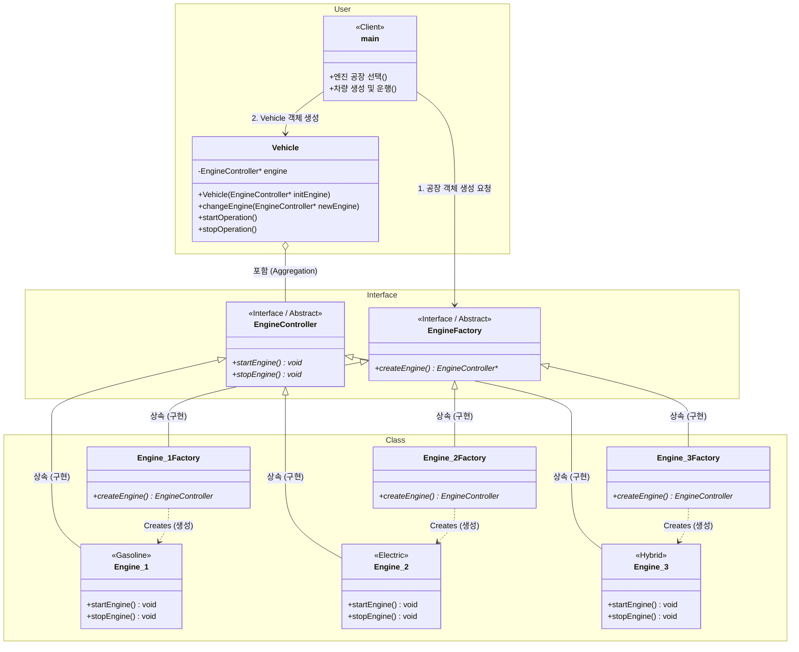

# 팩토리 메서드 패턴 아키텍처 다이어그램

회원님께서 요청하신 **User(사용자) ➡️ Interface(추상화) ⬇️ Class(구현체)** 형태의 `ㄱ`자 모형 다이어그램입니다.

> [!NOTE]
> 좌측 상단의 **User(main, Vehicle)**는 구체적인 하위 클래스들(우측 하단)의 존재를 전혀 모릅니다. 오직 우측 상단의 **Interface**들을 통해서만 소통하며, 이 형태가 객체 지향의 이상적인 `ㄱ`자형 의존성 흐름을 만들어냅니다.

### 💡 다이어그램 읽는 법
*   **실선 화살표 (`-->`)**: 사용(Uses) 또는 참조를 의미합니다. `main`과 `Vehicle`은 인터페이스만 참조합니다.
*   **빈 화살표 (`<|--`)**: 상속(Inheritance)을 의미합니다. 구체적인 클래스들이 인터페이스의 규칙을 따르고 있습니다.
*   **점선 화살표 (`..>`)**: 객체의 생성(Creates)을 의미합니다. 각각의 전담 공장이 자신에게 맞는 엔진을 생성합니다.
*   **다이아몬드 (`o--`)**: 집합(Aggregation) 관계로, 자동차(Vehicle)가 엔진(EngineController)을 부품으로 가지고 있음을 뜻합니다.
